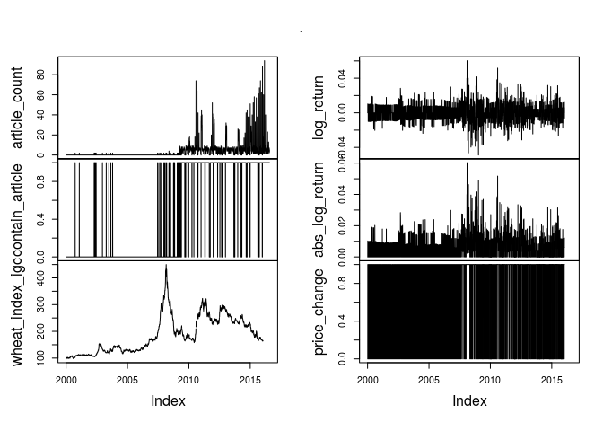
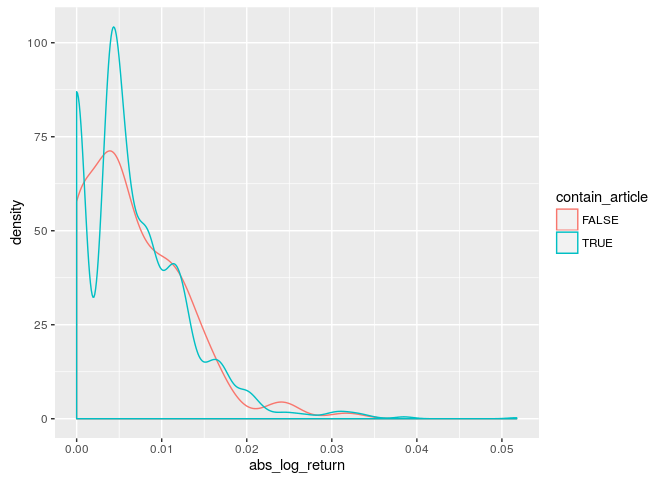

Introduction
------------

In this brief analysis, we examine the usability of the news article
scrapped and examine additional refinements. This opens up the necessary
work required to utilise the news articles for predicting food prices.
The wheat commodity is used for this particular exercise.

Two datasets are involved in this basic analysis. The first dataset is
**amis\_articles\_27\_07\_2016.feather** containing news articles which
was scrapped by Luca. The second dataset **wheat\_index\_igc.csv** is
the wheat index obtained from IGC.

Data processing
---------------

The following snippetes read, process and merge the data to a suitable
format for analysis.

    library(feather)
    library(dplyr)
    library(magrittr)
    library(zoo)

    ## Initialisation
    key_word = "wheat"
    file = "amis_articles_27_07_2016.feather"

    ## NOTE (Michael): Should allow multiple key words.

    ## Transform dates and check whether the article contains the key word wheat
    articles =
        read_feather(file) %>%
        mutate(date = as.Date(date),
               hasKeyWord = grepl(key_word, article))

    ## Count the number of articles containing key word per day
    articleCount =
        articles %>%
        subset(., hasKeyWord == TRUE) %>%
        group_by(date) %>%
        summarise(article_count = n()) %>%
        mutate(contain_article = article_count != 0)

    ## Read the wheat price data.
    wheatPrice.df =
        read.csv(file = "wheat_index_igc.csv", stringsAsFactors = FALSE) %>%
        mutate(date = as.Date(date, format = "%m/%d/%Y"),
               log_return = c(NA, diff(log(wheat_index_igc))),
               abs_log_return = abs(log_return),
               price_change = as.numeric(c(NA, diff(wheat_index_igc) != 0)))

    ## Merge the article count and price data
    merged.df =
        merge(articleCount,
              wheatPrice.df, by = "date", all = TRUE) %>%
        mutate(article_count = replace(article_count, is.na(article_count), 0),
               contain_article = replace(contain_article, is.na(contain_article), FALSE))

Below we first show the time series plot.

    ## Time series plot
    merged.df %>%
        read.zoo %>%
        plot

From the graph above, it seems we have very little information from news
source relevant to wheat prior to 2010. Below we will subset the data to
avoid distortion of the analysis.

    ## Subset the data after 2010
    subsetted.df =
        merged.df %>%
        subset(date >= as.Date("2010-01-01"))

Assessing predictability
------------------------

In this section, we conduct some very basic analysis on the
predicatbility based on the counts of the articles.

This analysis does not aim to draw any conclusion, rather, we seek to
identify areas of improvement and refinement.

If we are to rely on information extracted from news article and predict
the wheat price, then a simple method do so is to simply plot whether
the log return of the time series respond to the presence of news
articles.

The following plot shows the distribution of the absolute log return
with respect to the presence of news article.

    library(ggplot2)
    ggplot(data = subsetted.df,
           aes(x = abs_log_return, colour = contain_article)) +
        geom_density()

    ## Warning: Removed 272 rows containing non-finite values (stat_density).

Although we don't expect the market to be solely driven by the response
to public media, however, if this was the case then the absolute log
return should show two separate classes distinguish by whether a news
article about wheat is present. As expected, this does not seem to be
the case.

Let us take a closer look at the articles. Below we provide a few
articles which contains the key word `wheat` and examine the contain.

The article below although containing wheat and prices, however, it is
associated with trade. This does not appear to me should affect the
global wheat price as they are quoted in USD.

    articles$article[articles$hasKeyWord][3]

\[1\] "21/05/15 -- Fads, remember them? Tank tops, flares, skateboards,
the mullet haircut, shops where little fish nibble at your feet, the
bioethanol industry. Who on earth thought any of that crazy lot had any
longevity in them? Boy how we laughed at the hapless Americans when they
virtually "gave away" Ensus to the Germans. A plant that had cost what,
anywhere from GBP250-300 million to build sold for little more than
GBP10 million. The muppets. Suddenly that doesn't look quite like such
bad business though does it? Now the site looks set to remain closed for
some time (see: Meanwhile, down the road BP appear to have decided that
bioethanol production isn't their really bag, and have sold their 47%
stake in Vivergo to ABF, who now own 94% of it. I wonder what they'll do
with the cash (assuming that there is any)? They could do worse than
open up a chain of them e-cigarette shops, I reckon. 18/05/15 -- Current
pound strength against the US dollar isn't expected to last long,
according to Barclays. Last week's push to a 6-month high of over 1.58,
following the surprise Conservative majority in the General Election,
will be short-lived and the greenback will soon assert its superiority
over both sterling and the euro, they predict. Despite the pound hitting
its highest against the US currency since November last week, they
forecast a sharp drop to only 1.39 in the next quarter (down 11% from
where we are currently), falling to 1.38 in Q4 and 1.36 in Q1 of 2016.
The euro is likely to perform even worse. Barclays say "we believe that
the EUR has much further to go in its trend depreciation, albeit at a
slower pace and with higher two-way risks attached. Moreover, we still
think the EUR faces risks from a prolonged period of Greek political
uncertainty." The euro has recently risen close to 1.15 against the
dollar - it's best level since early February - but that won't last
long, with a fall to parity on the cards in Q3 of 2015 (a 13% decline),
and the single currency seen dipping below that level in Q4 (0.98) and
again in Q1 of next year (0.95). The pound will still continue its trend
of modest appreciation versus the euro, rising above the 1.40 level that
has proven to be a difficult nut to crack, in Q4 and hitting 1.43 in Q1
of 2016 for a near 4% increase on where we are today, they estimate. The
forecasts given for the pound seem pretty bearish in particular to me,
but IF they are proven correct then they could add some support to
London wheat. The outlook for the euro I can buy into more easily, which
would certainly continue to boost EU wheat exports in 2015/16, and again
help underpin Paris wheat. All this won't help US wheat exports though,
if it comes true, and it could certainly be construed as outright
bearish for US corn and soybeans given current planting progress figures
and the forecast for a non-threatening El Nino-linked summer. 2008 | "

The next article descibes the abolish of export duty. This again is
associated with trade rather than the wheat price.

    articles$article[articles$hasKeyWord][5]

\[1\] "15/05/15 -- As was fairly widely expected, Russia have today
announced that they are abolishing the punitive not less than
EUR35/tonne export duty on wheat. Well that's the floodgates open again
then I hear you cry. The carefully worded statement that accompanied the
announcement said that the move would provide Russian agricultural
producers with additional funds to carry out the spring sowing campaign.
Is that a little admission that spring plantings are in trouble?
Elsewhere I read of "talk" that the Russians might set their new crop
intervention price at levels that are higher than current world market
prices. Why would they do that, unless everything wasn't as rosy as they
are making out? Yesterday the Ag Ministry said that winterkill wasn't as
bad as they had earlier thought, reducing their estimate from 1.8
million ha to 1.3 million ha. They stood by their original forecast for
a total grain crop of 100 MMT. A nice round number that is don't you
think? I'm surprised that they didn't raise their estimate, what will
half a million hectares of less winterkill than expected. Meanwhile in
Ukraine, the latest official statements place 88% of winter grains in
good to satisfactory condition. Yet Mike Lee's recent Crop Tour of
Ukraine "called a slightly different assessment with 62% good and
satisfactory, 34% poor and 5% very poor" his public blog states. You
won't be surprised to hear that his assessment of things in Russia
weren't as bullish as those of their Ministry of Lying either. Mike's
second crop tour of Ukraine and Russia, when he looks at spring
plantings as well as developing winter crop conditions, will surely be a
must read. You can subscribe to that for a very modest fee. Find out
more here: 2008 | "

This article although related to the production of wheat, however, it is
particular to a single company. This may be more appropriate for equity
analysis rather than commodity price.

    articles$article[articles$hasKeyWord][100]

\[1\] "BEECH GROVE, INDIANA, U.S. ADM Milling, a wholly owned subsidiary
of Archer Daniels Midland Company on July 9 celebrated the completion of
a substantial expansion at its wheat processing plant in Beech Grove,
Indiana, U.S., a suburb of Indianapolis. Our customers continue to grow,
and it is our job to support them in that growth, said Mark Kolkhorst,
president of ADM Milling. This new capacity will allow us to expand
without sacrificing the service and quality that our customers
throughout the region have come to expect. With the expansion, the Beech
Grove wheat milling facility is now the third largest in the nation.
Equipped with the latest modern technology, the mill now has a
production capacity of 28,000 hundredweights (cwts) per day, a 45%
increase. With eight new fast load-out bins, total flour load-out
capacity has been increased by nearly 100%. The addition also includes
more than 31,000 cwt of new flour storage. Products at Beech Grove
include spring, winter and hard soft wheat flour blends, providing a
range of options for customers. The facility serves customers primarily
in Indiana, Kentucky and Ohio."

The final article shown below relates to the development of organic
wheat and increased production. However, we need to take into account of
the size of organic wheat.

    articles$article[articles$hasKeyWord][3000]

\[1\] "DENVER, COLORADO, U.S. Ardent Mills, a flour-milling and
ingredient company, announced on Dec. 15 a new organic initiative
committed to helping U.S. wheat growers double organic wheat acres by
2019. "Ardent Mills' vision is to be the trusted partner in nurturing
our customers, consumers and communities through innovative and
nutritious grain-based solutions, and our new organic initiative
demonstrates one of the many ways we're bringing that vision to life,"
said Ardent Mills Chief Executive Officer (CEO) Dan Dye. Today, there is
growing demand from restaurants and food companies for organic wheat
flour for use in fresh, packaged and menu recipes. This is a significant
opportunity for growers to become a part of an emerging market and to
create additional value for their crops on the path to organic
certification. We have been providing organic flour since 1996 and feel
we are well positioned to meet this bold challenge." "We're very excited
to work with farmers as they transition to this growing market and to
provide our customers with an assured supply in support of their new
product and menu introductions, said Ardent Mills Vice-President of Risk
Management Mike Miller. We know there is demand that will continue to
increase well into the future. We've heard from farmers we work with,
and we understand the barriers that they face when transitioning to
organic. Ardent Mills is addressing these challenges with our Organic
Initiative 2019." "Based on our customer and consumer research, we see
considerable demand for products produced with wheat from our program.
We will provide a robust supply chain to meet the growing consumer
demand for a variety of organic grain-based products," said Ardent Mills
Vice-President of Sales Dean Grossmann. As farmers join the Ardent
Mills' organic initiative, they will have access to direct support
services, workshops and long-term contracts for transitional and organic
wheat bushels. "Oregon Tilth is eager to share best practices and share
knowledge among farmers working through the challenges of transition to
organic agriculture, said Sarah Brown, Oregon Tilth education director.
We believe that collaborative education peer-to-peer learning, model
sharing and capacity building serves to support successful entry into
organic farming, offering buyers and farmers a solid path to connect
market opportunities with on-the-ground efforts to implement sustainable
conservation practices on the farm." "Ardent Mills has been a great
industry partner and we commend the company for reaching out to our
growers to offer new incentives to meet a growing market segment," said
Brett Blankenship, president of the National Association of Wheat
Growers. "There is an opportunity for a premium, and the incentive gives
farmers access to an additional market and a new income stream while
meeting growing consumer demand for organic wheat flour and organic
foods. Ardent Mills is to be commended for developing an incentive-based
approach that may be attractive to our growers.""

Potential Work Areas
--------------------

Below we propose the following work in order to improve the usability.

### Create Commodity Tags

As we have done in this brief analysis, we have identified articles
which contains the key word `wheat`. We should tag all articles with
relevant key words in order to associate the relevant sentimental index
to the respective commodity.

### Create Cluster Tags

From the sample of the articles above, we can see although wheat is
contained in all of the article, but they may relate to different
dimensions. From trade, equity to technological improvements. If we can
also create tags which describe the nature of the article, this will
certainly further improve the predictability and the relevance of the
information.

### Response Function

In the above analsis, we have only shown the relationship per day to
day. We should investigate models which can capture the response of the
market with respect to new informations.

Conclusion
----------

The key find of this preliminary analysis shows that in order to
efficiently utilise the news content, we have to take an extra step to
extract the relevant information from the news article that is relevant
to the food price.
